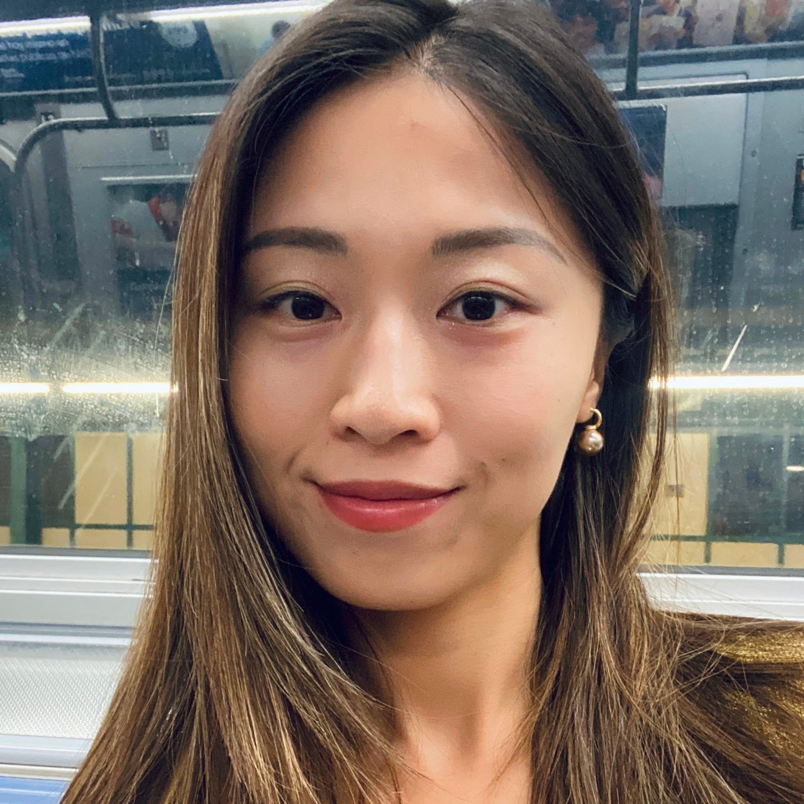

## About Me

I'm an indepedent AI safety researcher, also a software engineer based in New York. 

I engage with AI safety since 2018, spanning myself from AI policy to AI safety technical work. My research interests include how AI perceives its human user, and LLM hallucination. I make technical AI safety research using mechanistic interpretability. Back to my earlier days, I investigated ML-application in the tenent-screening industry, and forecasted [Arroyo v. CoreLogic (2018)](https://www.nhlp.org/our-initiatives/arroyo-v-corelogic/). My ML policy work was accepted by [ACM FAccT](https://facctconference.org/) 2019.

I'm particularly good at cross-domain pattern recognition and connecting dots that most didn't see. My best work has been constantly achieved by reframing an intractable problem into one with feasible solutions. I thrive in a lot of intellectual complexity and with execution autonomy. I'm actively looking for collaborators! I'd be happy to hear about your work as well, let's chat!

## Selected Work
- [I and Thou: Turning the Mirror on the Machine](https://violazhong.github.io/i-and-thou-vector/)
- [Llama2 Safety Evaluation Anatomy](https://violazhong.github.io/Llama2-safety-eval-anatomy/)
- [LLM Hallucinations: An Internal Tug of War](https://violazhong.github.io/llm-hallucination-an-internal-tug-of-war/)

## My Experience
Before moving to the US, I was part of the founding product and marketing team at [Smart Order](https://www.smartorder.ai/) in Hangzhou, China. I moved to NY to study data science in [NYU CUSP](https://engineering.nyu.edu/research/centers/cusp). After that, I spent a year as a research fellow with the [New York City Commission On Human Rights](https://www.nyc.gov/site/cchr/index.page), focusing on AI policy and fairness in machine learning. When I'm not in front of a screen, I'm also a [Guqinist](https://www.metmuseum.org/art/collection/search/500624), a [Chinese calligrapher](https://www.metmuseum.org/essays/chinese-calligraphy).

## Contact
- **Email:** violazhng[at]gmail.com
- **GitHub:** [github.com/violazhong](https://github.com/violazhong)
- **X** [x.com/viola_zhongg](https://x.com/viola_zhongg)
- **Substack** [substack.com/@violazhong](https://substack.com/@violazhong)
