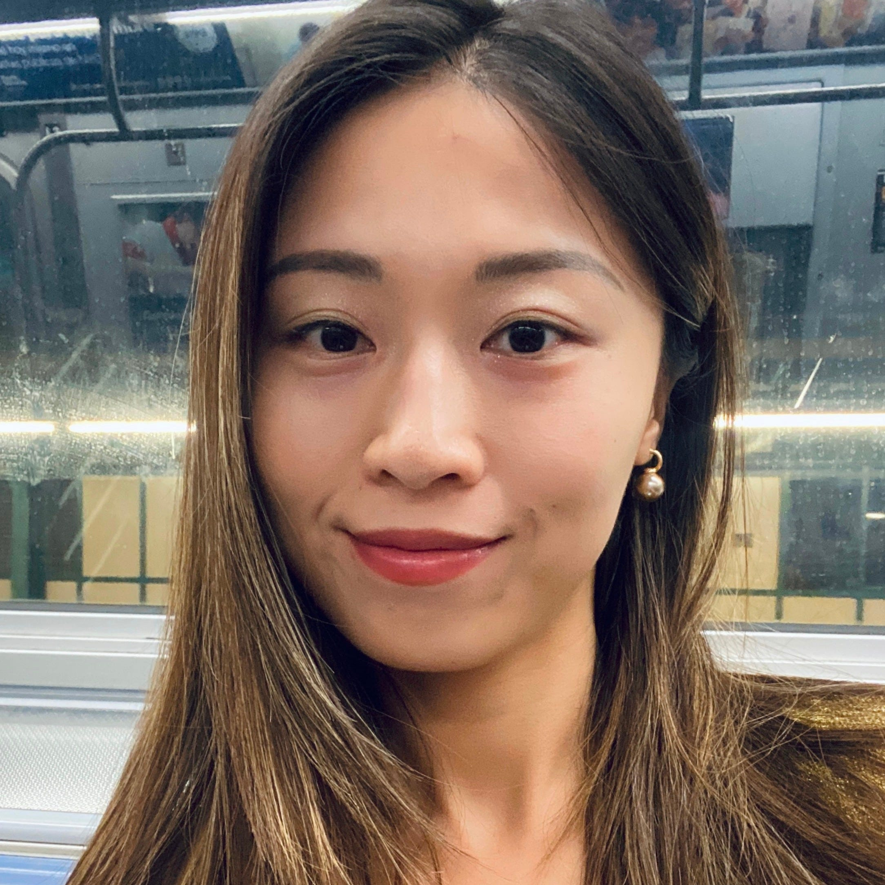

## About Me

I'm an AI safety researcher, a software engineer based in New York. 

I engage with AI safety since 2018, spanning from AI policy to AI safety technical work. My research focus is how AI perceives its human user, and I use mechanistic interpretability. I investigated ML-application in tenant-screening, and forecasted [Arroyo v. CoreLogic (2018)](https://www.nhlp.org/our-initiatives/arroyo-v-corelogic/). My ML policy work was accepted by [ACM FAccT](https://facctconference.org/) 2019.

I'm particularly good at cross-domain pattern recognition and connecting dots that most didn't see. My best work has been constantly achieved by reframing an intractable problem into one with feasible solutions. I thrive in a lot of intellectual complexity and with execution autonomy. 

I'm actively looking for collaborators! I'd be happy to hear about your work, let's chat!

## Selected Technical Work
- [Refusal Lives Downstream of Persona in Chat Models](https://arxiv.org/abs/2606.26161) · May 2026 (ICML 2026 Mech Interp Workshop)
- [I and Thou: Turning the Mirror on the Machine](https://violazhong.github.io/i-and-thou-vector/) · Feb 2026
- [Llama2 Safety Evaluation Anatomy](https://violazhong.github.io/Llama2-safety-eval-anatomy/) · Jan 2026
- [LLM Hallucinations: An Internal Tug of War](https://violazhong.github.io/llm-hallucination-an-internal-tug-of-war/) · Aug 2025

## Selected Policy Work
- [AI-accelerated cyber Exploitation: reframing the threat and a hybrid response](https://policy.swiftcentre.org/?category=cmo79jtf20000mn5rhx88abh0&advice=cmo7jif5i0003qw5reybo6czu#submissions) · April 2026 (Swift Centre 'Bridge the Gap' Open Policy Competition)
- [Framing Bias and Approaching Fairness in Algorithmic-based Tenant Screening Tools under the NYCHRL](https://github.com/violazhong/AI-Policy-Work/blob/main/FAccT_2019_workshop_submission.pdf) · Oct 2018 (ACM FAccT 2019 Translation Tutorial Workshop)

## My Experience
Before moving to the US, I was part of the founding product and marketing team at [Smart Order](https://www.smartorder.ai/) in Hangzhou, China. I moved to NY to study data science in [NYU CUSP](https://engineering.nyu.edu/research/centers/cusp). After that, I spent a year as a research fellow with the [New York City Commission On Human Rights](https://www.nyc.gov/site/cchr/index.page), focusing on AI policy and fairness in machine learning. I play [Guqin (a Chinese zither)](https://www.metmuseum.org/art/collection/search/500624). I also practise [Chinese calligraphy](https://www.metmuseum.org/essays/chinese-calligraphy).

## Contact
- **Email:** violazhongg[at]gmail.com
- [**GitHub**](https://github.com/violazhong)
- [**X**](https://x.com/viola_zhongg)
- [**Google Scholar**](https://scholar.google.com/citations?user=Zq6eTzkAAAAJ&hl=en)
- [**Substack**](https://substack.com/@violazhong)
