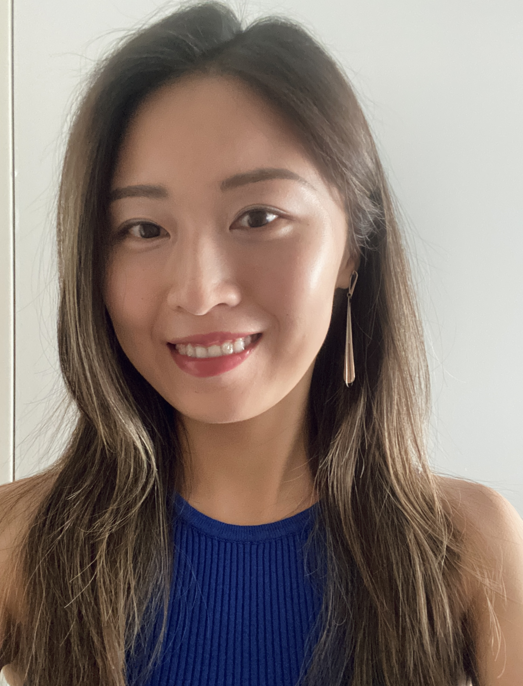

## About Me

I'm a software engineer based in New York. I came here to study data science in [NYU CUSP](https://engineering.nyu.edu/research/centers/cusp). Then I spent a year as a research fellow with the [New York City Commission On Human Rights](https://www.nyc.gov/site/cchr/index.page), focusing on AI policy and conducting independent research on [fairness in machine learning](https://fairmlbook.org/). Before New York, I was part of the founding product and marketing team at [Smart Order](https://www.smartorder.ai/) in Hangzhou, China. I'm also a [Guqinist](https://www.metmuseum.org/art/collection/search/500624), a [Chinese calligrapher](https://www.metmuseum.org/essays/chinese-calligraphy). When I'm not in front of a screen, I enjoy cooking and spending time with my pets.

## My Work
- [LLM Hallucinations: An Internal Tug of War](https://violazhong.github.io/llm-hallucination-an-internal-tug-of-war/)

## Contact
- **GitHub:** [github.com/violazhong](https://github.com/violazhong)
- **X** [x.com/viola_zhongg](https://x.com/viola_zhongg)
- **Substack** [substack.com/@violazhong](https://substack.com/@violazhong)